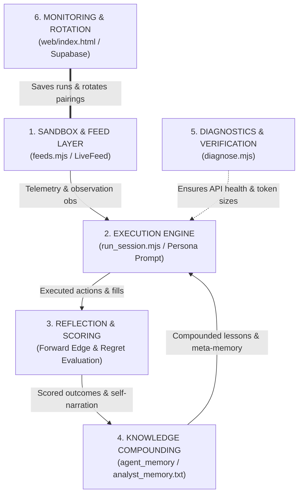

# Trench Bench: 6-Component Agentic Trading Loop

This document specifies the architecture of the Trench Bench benchmarking harness, defining the components, their interactions, and the data flow of the closed-loop meta-learning system.

---

## 1. Architectural Diagram



---

## 2. Segment Specifications

### Component 1: Sandbox & Feed Layer
* **Inputs**: Live Pump.fun WebSocket events, Dexscreener price API queries, or mathematical simulation engines.
* **Telemetry compilation (`obs`)**:
  - `price`: Spot price.
  - `mom`: Price change over the last 12 rounds.
  - `dev`: Deviation from the 24-round moving average.
  - `liq`: Total USD pool liquidity.
  - `vol5m`: 5-minute transaction volume.
  - `cap`: Token market capitalization.
* **V2 Mid-Session Injection**: Keeps WebSocket discovery open in the background, dynamically setting new tokens to `active: false` on discovery. Every 5 rounds, if assets are under 40, one new launch is flipped to `active`, priced, and injected into the roster.
* **Interactive Simulator Upgrades (Feedback Loops)**:
  - **Hype/Momentum price feedback**: Past returns feed into the simulated drift, creating realistic trend-following patterns.
  - **Permanent trade price impact**: Buying simulated assets pushes their spot price up, and selling pushes them down, creating an interactive agent-driven AMM economy in simulation mode.
  - **Hybrid Live-Price Alignment**: In live mode, sandbox asset prices are pulled towards real-world spot prices via a gravitational alignment function ($\kappa = 0.20$ per tick). This allows local agent trades to have price impact while dynamically anchoring the sandbox to real-world pumps and dumps (arbitrage/replenishment simulation).

### Component 2: Agent Execution Engine
* **Persona Directives**: 8 distinct trading personas (e.g. *Value Val*, *Momentum Mia*, *Degen Dex*) defined with custom temperature, `risk` factor, and portfolio limits.
* **Choice Menus**: Every round, the engine builds a list of contextual choices (e.g. `BUY SOL`, `SELL USDC`, `SWAP`, `REBALANCE`, `HOLD`).
* **Position Sizing (V2 Liquidity Guard)**:
  - Buy size is capped at 5% of target token pool liquidity to prevent market distortion:
    $$\text{tradeSizeUsd} = \min(\text{dynRisk} \times \text{cash}, \max(100, \text{liq} \times 0.05))$$
  - Order execution price is calculated using simulated AMM bonding curves:
    $$\text{execPx} = \text{spotPx} \times \left(1 \pm \frac{\gamma}{2}\right) \quad \text{where } \gamma = \frac{\text{tradeSizeUsd}}{\text{liq}}$$

### Component 3: Reflection & Scoring
* **Retrospective Horizon ($H = 10$ rounds)**: Scored once the horizon has elapsed.
* **Metrics**:
  - **Edge**: Compares the asset's return over the horizon to the market's median return ($mh$):
    $$\text{edge} = \text{forward\_ret} - \text{sign} \times mh$$
  - **Regret**: Measures the difference in edge between the chosen action and the best available option on the menu at that tick:
    $$\text{regret} = \max(0, \text{best\_edge} - \text{taken\_edge})$$
  - **Hit Rate**: Percentage of model trades that achieved positive edge.

### Component 4: Knowledge Compounding
* **Individual Memory**: Agents review their performance and write text lessons to `agent_memory` in Supabase. These lessons are queried on startup and injected into prompts (`MEM:bought_high_panic_sold`).
* **Meta-Memory (The Analyst)**: Reads the synthesised performance data of the previous session (`logs/analyst_memory.txt`) to adapt its risk and strategy.

### Component 5: Diagnostics & Testing
* **Uptime Check**: Pings Ollama and databases, checking endpoint reachability.
* **headroom Check**: Verifies that formatting flags (`think: false` and `num_predict: 384+` for choice retries) are configured correctly to prevent reasoning token truncation and rule fallbacks.

### Component 6: Monitoring, Archiving & Pairing
* **Standings Table**: Derives equity curves and returns from the database. Employs a defensive JS comparator to handle null values and positions bankrupt agents (equity < $10) at the bottom.
* **Latin Square Pairing**: Automatically rotates model-persona pairs across sessions to decouple model performance from persona constraints.

---

## 3. Digital Twin State Vector (Context Representation)

Rather than sending raw JSON structures, the worker performs **lossless state vector compression** to represent the exact sandbox environment within the LLM's token budgets.

### State Compression Format (`usr` Prompt)

```ini
[SESSION CONTEXT]
Round: [current_round_number] | Market: [Live Solana (Dexscreener aligned) | Mathematical Simulation] | Mode: V2 Profit Maximization

[STATE]
EQ:$[total_equity]|CASH:$[available_cash]|PNL:[pct_change]|POS:[count]/[limit]
HOLDINGS:[symbol][qty@avg_entry->current_spot|open_pnl_pct],...
RECENT:[tick_number]:[action]_[symbol]@[price][trade_pnl_pct],...|MEM:[past_written_lessons]

[MENU]
0) BUY [symbol] [LQ:[pool_liquidity]|V5:[volume_5m]|MC:[mcap]|M1:[mom_1m]|M15:[mom_15m]|M60:[mom_1h]]
1) SELL [symbol] [PNL:[pct_gain]]
2) SWAP [sell_symbol] -> [buy_symbol]
3) REBALANCE
4) HOLD
```

