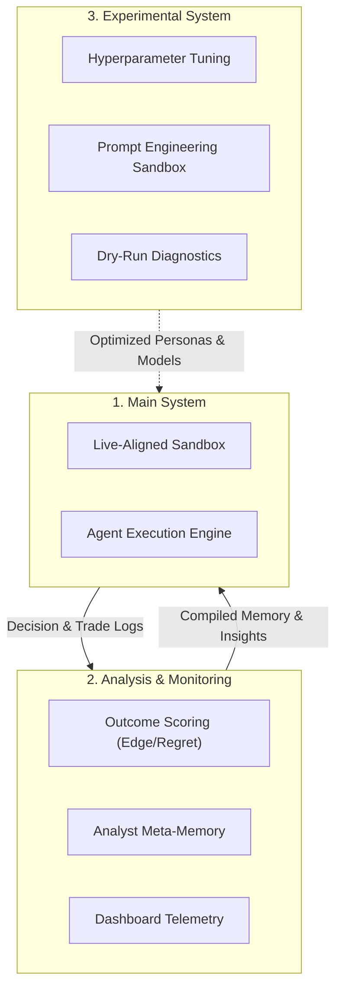
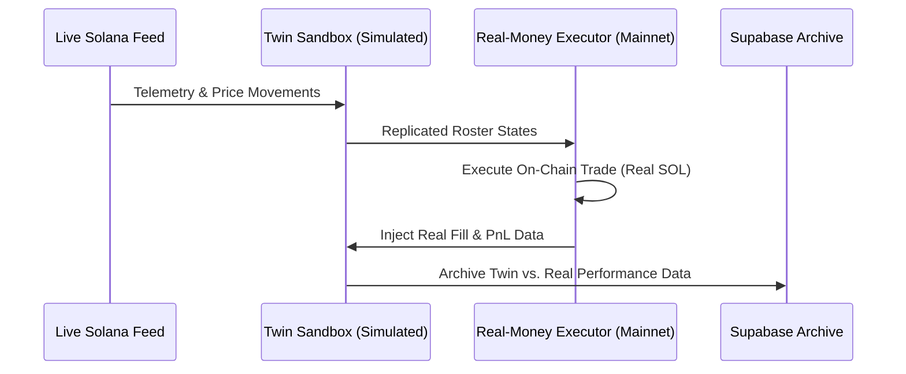

# Trench Bench: Brainstorming & Evolution Roadmap

This document serves as the persistent repository for our conceptual design notes, brainstorming sessions, and long-term architectural evolution roadmap.

---

## 1. Core Vision: The Living Agentic Ecosystem
* **Token Efficiency**: Every component is designed to extract *maximum intelligence from the least tokens* through dense compression formats, system prefaces, and ex-ante filters.
* **Continuous Evolution**: A self-contained, closed loop where agents learn from their own history and the Analyst adjusts parameters over seasons.

---

## 2. Three-Tier System Architecture

### 1. Main System (The Production Sandbox)
* **Status**: Running (V2 / Season 2).
* **Role**: Runs the live sessions. Telemetry is gathered from live sources, processed through the AMM execution engine, and presented as state vectors.
* **Goal**: Maximizing simulated yield while applying realistic constraints (liquidity caps, stop-losses).

### 2. Analysis & Monitoring System (The Reflection Engine)
* **Status**: Implemented (Supabase DB + Web UI + Analyst Memory).
* **Role**: Computes mathematical edge/regret, stores memory files, and maps agent career standings.
* **Goal**: Providing the data-dense learning layers that allow agents to evolve across sessions.

### 3. Experimental System (The Innovation Lab)
* **Status**: In development (diagnose tools, custom configuration tests).
* **Role**: Offline or isolated environments where we can test new prompts, modify target execution parameters, and introduce new models before pushing them into the Main system.

---

## 3. Future Horizon: Real-Money Agent Integration

To turn this sandbox into a truly living system, we will introduce a **Real-Money Agent** trading on the live Solana mainnet alongside our simulated digital twins:

### Key Integration Points:
* **The Digital Twin Feed**: The Real-Money Agent's mainnet transactions (execution price, slippage, wallet balances) will be streamed directly into the Sandbox.
* **Cooperative Data**: Simulated agents will see the Real-Money Agent's moves on their menu as additional telemetry, allowing them to ride its momentum or trade against its positions.
* **Benchmark Validation**: Directly compares simulated paper-trading edge against real mainnet execution slippage, validating the accuracy of the AMM bonding curve formula.
