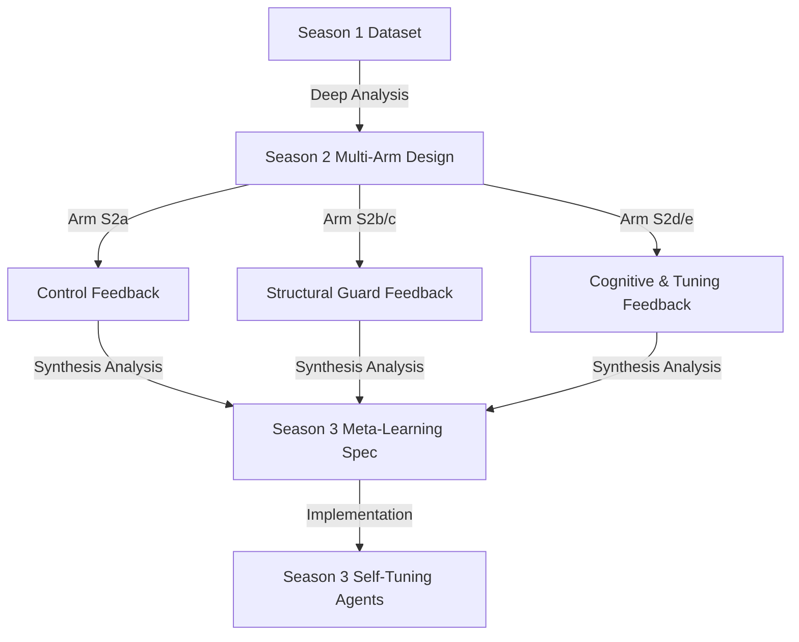

# Season 2 Master Experimental Specification & Season 3 Feedback Loops

This document defines the master design specification for the **Season 2 Multi-Arm Experimental Framework**. It outlines the control mechanisms, configurations, and the mathematical and logical feedback loops that will use Season 2 data to synthesize and automate **Season 3 (S3) Self-Tuning Agents**.

> [!NOTE]
> **Exploration & Experimentation Mandate**: In these early stages of Season 2, our primary goal is to encourage broad experimentation and active trading. While we implement structural guards to protect against catastrophic capital erosion (e.g., Slippage Shield), we intentionally keep thresholds flexible to allow agents to trade actively, explore diverse strategies, and discover new profit-maximization pathways. This maximizes the volume and coverage of our transaction findings to provide the richest possible dataset for Season 3 synthesis.

---

## 1. Season 1 Retrospective & V2 Core Upgrades

Based on the deep pattern analysis of **106,214 decisions** and **28,416 completed trades** in Season 1, three major performance bottlenecks were identified:
1. **Slippage Erosion**: Hyperactive trading in low-liquidity pools leading to massive entry costs.
2. **Panic Selling**: Average hold duration was a mere 11.3 rounds, and win rates were 16.6%, destroying alpha before trades could mature.
3. **Over-Trading**: Agents executed active orders without regard for market volatility or transaction costs.

The V2 trading engine addresses these bottlenecks with the following structural upgrades, carefully balanced to encourage calculated risk-taking rather than passive holding:
1. **Slippage Shield**: Cap order sizes dynamically at 5% of target pool liquidity.
2. **Volatility-Scaled Sizing**: Scale down position sizes proportionally during periods of violent 1m momentum volatility, allowing agents to take high-risk trades but at a lower capital impact.
3. **Spot Bankruptcy**: True bankruptcy at $10 equity, removing the forced 2% bottom liquidation.
4. **Soft Anti-Panic Timers**: A short 5-round soft block on panic selling, forcing agents to let a trade breathe momentarily unless a catastrophic loss threshold (-50%) is hit, while still allowing them to trade dynamically.
5. **Cognitive Priming & Cost Awareness**: Injecting `[SESSION CONTEXT]` (Round X/Y), a parameter telemetry legend, and explicit warnings about 1% slippage costs to enforce higher-conviction bets.

---

## 2. Experimental Control Arms (S2a - S2e)

To systematically isolate the value of each upgrade and establish a structured foundation for S3, Season 2 will be run in 5 distinct control arms (10 tests each). Here is the detailed breakdown of what we are checking, why, and how we will use the results to synthesize Season 3:

### Configuration & Decision Matrix

| Arm | What We Check | Why (Hypothesis) | How S3 Will Use It (Decision Tree) |
| :--- | :--- | :--- | :--- |
| **`S2a`**<br>(Control) | • S1 raw size rules<br>• 2% bottom liquidation<br>• Stateless prompts | Establish baseline performance under V2 environment. | Represents the starting point. All other arms must beat S2a to prove their value. |
| **`S2b`**<br>(Execution) | • Slippage Shield (5% cap)<br>• Volatility sizing<br>• 2% bottom liquidation<br>• Stateless prompts | Validate if scaling entry size based on pool liquidity and volatility prevents slippage erosion. | If P&L improves vs S2a, lock the Slippage Shield as an immutable V3 core feature. If not, test dynamic pool-specific sizing. |
| **`S2c`**<br>(Patience) | • Slippage + Volatility Shield<br>• Spot rules ($10 bankruptcy)<br>• Soft hold timer (5 rounds)<br>• Bag-holding cap (30 rounds) | Validate if preventing immediate panic selling (1-2 ticks) and capping bag-holding (50+ ticks) outperforms raw stop-losses. | If average hold shifts to the 3-30 tick sweet spot and return increases, hardcode this hold window. If stop-losses still win, S3 will use trailing stop-losses. |
| **`S2d`**<br>(Cognitive) | • Slippage + Volatility Shield<br>• Spot rules + Hold window<br>• Cognitive priming (Legend + Cost)<br>• Stateless prompts | Validate if warning models of transaction costs and giving round numbers reduces capital churn and late-session over-trading. | If trade count decreases and P&L increases near the end of sessions, integrate short-term memory vectors in S3 prompts. |
| **`S2e`**<br>(Optimized) | • Slippage + Volatility Shield<br>• Spot rules + Hold window<br>• Cognitive priming<br>• Optimized S2 Persona parameters | Validate if manual tuning of risk/tp/sl parameters provides a performance boost over standard S2d configurations. | If S2e beats S2d, we will implement the **Regret Gradient Optimization** in S3 to let agents auto-tune their parameters. |

### Crowded Trade (Anti-Collision) Test Parameter
Across all arms, we will track the **Collision Rate** (when $\ge 3$ agents buy the same token in the same round).
* **Why**: S1 data shows that concurrent buying spikes entry prices, immediately placing all buyers underwater.
* **How S3 Will Use It**: If collision-induced slippage remains a major loss contributor in S2 (even with the 5% shield), S3 will implement an **Anti-Collision Coordination Protocol**: sizing down orders or delaying execution when multiple agents select the same target.

### Hold Window Parameters (Arm `S2c` onwards)
* **Soft Hold Timer (5 rounds)**: Prevents exit before round 5 unless a catastrophic drop (-50%) occurs. *Targeting: S1's unprofitable 1-2 tick hold bin.*
* **Stale Position Exit (30 rounds)**: Hard cap to force liquidate positions that have not hit TP/SL within 30 ticks. *Targeting: S1's unprofitable 50+ tick bag-holding.*

### Optimized Persona Settings (Arm `S2e` Only)
* **Degen Dex**: `risk` reduced from `0.50` -> `0.40` (preserves cash to buy dips).
* **Momentum Mia**: `tp` reduced from `20` -> `15`, `sl` tightened from `-10` -> `-8` (matches fast momentum decay).
* **The Analyst**: `risk` reduced from `0.30` -> `0.25` (encourages conservative synthesis of recent market reports).

---

## 3. Season 3 (S3) Evolutionary Feedback Loop

The data collected from these 5 arms will serve as the training and synthesis dataset for **Season 3 (S3)**. Here is the feedback loop mapping:



### Feedback Loop 1: Execution & Patience Validation (S2a vs. S2b vs. S2c)
* **Hypothesis**: Volatility-scaled sizing and soft hold timers will significantly increase the average trade return from `+0.44%` to `+3.00%` or more by curing panic selling and slippage erosion, without disabling the agent's ability to take risks.
* **S3 Action**: If validated, these structural guards will be locked as immutable system-level primitives. If stop-losses (S2b) outperform holding (S2c), S3 will implement dynamic trailing stop-losses instead.

### Feedback Loop 2: Cognitive Priming Validation (S2c vs. S2d)
* **Hypothesis**: Time-awareness (Round X/Y) allows models to trade conservatively near the end of a session, reducing cash drag and end-of-session losses.
* **S3 Action**: If validated, S3 will expand cognitive context to include **historical session memory vectors** (e.g. retrieving past choices made in similar market situations from a vector database).

### Feedback Loop 3: The Path to Season 3 Self-Tuning Agents (S2d vs. S2e)
* **Hypothesis**: The manual tuning of persona risk parameters in S2e will outperform S2d.
* **S3 Action**: If validated, S3 will remove hardcoded persona parameters entirely. Instead, it will implement a **Self-Tuning Reinforcement Loop**:
  - After each round, agents calculate their decision "regret" (the edge difference between their action and the best possible menu choice).
  - An optimization script will run at session end, adjusting each agent's persona risk, tp, and sl parameters based on their historical regret gradient.
  - **Agents will evolve their own personalities over time.**

---

## 4. Control Mechanism Specification

To implement this framework safely, we will build a control system with two files:

### 1. `config.txt` Integration
We will add a single control variable:
```ini
# Configurations: s2a, s2b, s2c, s2d, s2e
EXPERIMENTAL_ARM=s2d
```

### 2. Batch runner Utility: `worker/run_experimental_batch.mjs`
This script will allow executing batches of sessions under specific arms:
```bash
node worker/run_experimental_batch.mjs <arm> <num_runs>
```
* **Behavior**:
  - Automatically updates `EXPERIMENTAL_ARM` in `config.txt` to the specified arm.
  - Launches `run_session.mjs` in sequence for `num_runs` iterations.
  - Appends the arm name as a prefix to the session name (e.g., `"S2d - Run 3"`) and tags the session database row for seamless UI auditing.
