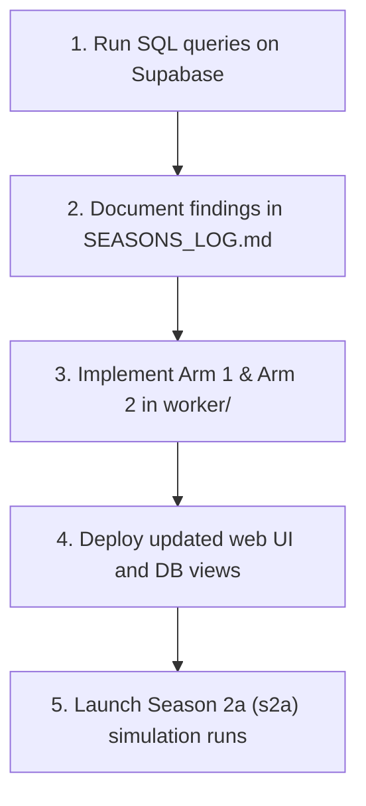

# Trenchbench Season 2a Research & Test Plan (`docs/SEASON2a_RESEARCH_AND_TEST_PLAN.md`)

This document outlines the systematic plan to analyze Season 2 results and design empirical tests for Season 2a (s2a). 

---

## 1. Research Phase: Database Query Protocols

To let any future AI model or developer perform their own research, we define the exact SQL query scripts to analyze the concluding Season 2 results in Supabase.

### Query A: Trading Frequency vs. PnL Correlation
*   *Objective*: Verify if overtrading is dragging down net returns due to fees and slippage.
*   *SQL Script*:
    ```sql
    select 
      model,
      count(distinct session_id) as sessions,
      sum(trades) as total_trades,
      round(avg(trades)::numeric, 1) as avg_trades_per_session,
      round(avg(ret)::numeric, 2) as avg_return,
      round(sum(realized_pnl)::numeric, 2) as total_pnl
    from agent_reports
    where not is_baseline
    group by model
    order by avg_return desc;
    ```

### Query B: Slippage and Friction Analysis
*   *Objective*: Calculate the average slippage and realized loss on token exits.
*   *SQL Script*:
    ```sql
    select 
      model,
      action,
      count(*) as total_actions,
      round(avg(realized_pnl)::numeric, 2) as avg_pnl,
      round(avg(fwd_ret)::numeric, 4) as avg_forward_return,
      round(avg(edge)::numeric, 4) as avg_alpha
    from decision_outcomes
    where brain = 'model'
    group by model, action
    order by model, avg_alpha desc;
    ```

### Query C: Persona-Model Pairing Effects
*   *Objective*: Identify if specific trading strategies (personas) are better suited for specific models.
*   *SQL Script*:
    ```sql
    select 
      model,
      agent_id as persona,
      agent_name,
      runs,
      avg_return,
      avg_hit_rate,
      pairing_effect
    from lb_model_persona
    order by avg_return desc;
    ```

### Query D: Fallback & Syntax Error Audits
*   *Objective*: Identify which models suffer from high timeouts or formatting failures.
*   *SQL Script*:
    ```sql
    select 
      model,
      count(*) as total_calls,
      count(*) filter (where brain = 'model') as successful_format_calls,
      count(*) filter (where brain = 'rules') as fallback_calls,
      round((count(*) filter (where brain = 'rules'))::numeric / count(*) * 100, 1) as fallback_rate_pct
    from decisions
    where model is not null
    group by model
    order by fallback_rate_pct desc;
    ```

---

## 2. Season 2a (s2a) Experimental Design

Based on initial findings, we propose three experimental test arms to be run in Season 2a to improve agent performance:

### Test Arm 1: Slippage Mitigation (Codebase version `v2.0.1`)
*   **Hypothesis**: Giving models granular trade size options (e.g. 1%, 2.5%, 5% of total pool liquidity) rather than a single fixed size will reduce market impact and increase realized yields.
*   **Implementation**:
    *   Modify `worker/run_session.mjs` to expand the decision menu, allowing models to select trade volumes.
    *   Expose the current estimated price impact (slippage) of each option on the menu.

### Test Arm 2: Trend & Momentum Indicators (Codebase version `v2.0.2`)
*   **Hypothesis**: Exposing technical metrics will help models identify overbought situations and avoid buying at local peaks.
*   **Implementation**:
    *   Compute simple technical trend indicators (e.g., Simple Moving Averages or RSI) inside `run_session.mjs`.
    *   Inject token age (ticks since creation) into the compressed `[STATE]` vector to help models detect mature or overextended charts.

### Test Arm 3: Prompt & Context Tweaks (Codebase version `v2.0.3`)
*   **Hypothesis**: Explicitly warning models about the bonding curve mean-reversion pull ($\kappa = 0.20$) will improve their predictive accuracy (edge).
*   **Implementation**:
    *   Inject bonding curve physics warnings directly into the `[SESSION CONTEXT]` prompt block.

---

## 3. Work Plan & Execution Pipeline



1.  **Execute SQL Scripts**: Run Queries A, B, C, and D against the live Supabase project.
2.  **Log Empirical Baseline**: Document the detailed numbers in `docs/SEASONS_LOG.md` under Season 2.
3.  **Codebase Changes**: Implement the slippage mitigation menu and indicator indicators in `worker/run_session.mjs`. Update codebase version details in `docs/CHANGELOG.md`.
4.  **Execute s2a Run Batches**: Run the simulation cycle to compare performance metrics against the Season 2 base state.
