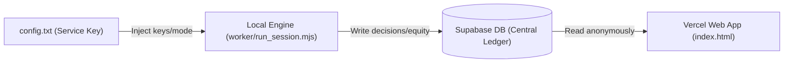

# Trenchbench System Context (`docs/SYSTEM_CONTEXT.md`)

Welcome, developer or AI agent. This document is the single source of truth for the Trenchbench (pumpmind) system. It outlines the core architecture, data contracts, database schema, operational mechanics, and instructions for how to interact with this codebase.

---

## 1. AI System Instructions (Meta-Prompt)

If you are an LLM onboarding to this repository, you must adhere to the following rules:

1.  **Zero NPM Dependencies**: The repository is designed to be completely dependency-free in the root and `worker/`. All API requests, data ingestion, and database writes are executed using raw standard `fetch` APIs. **Do not run `npm install` or add dependencies.**
2.  **No Standalone Analysis Scripts**: Do not write standalone Node.js scripts (like `analyze.mjs` or `query_mom.mjs`) to analyze results. Analytical scripts quickly become obsolete as schemas evolve. Instead, **write raw SQL queries** directly against the Supabase database to compile analytics.
3.  **Preserve the 6-Stage Loop**: The worker simulation engine runs on a strict cyclic protocol. Any changes to agent logic must respect the transitions: *Observation ➔ Action ➔ Reflection ➔ Evaluation ➔ Reward ➔ Memory*.
4.  **Documentation Anchors**: Keep this context file, `docs/CHANGELOG.md`, and `docs/SEASONS_LOG.md` updated when making system-wide modifications.

---

## 2. System Architecture & Lifecycle

Trenchbench is a session-based AI trading benchmark simulating agents trading Solana/Pump.fun tokens under realistic liquidity and slippage constraints.



### The 6-Component Agentic Loop

For each active agent in a session, the engine cycles through the following states:

1.  **Observation**: Gather current portfolio balance, open positions, prices, RSI metrics, and market trends.
2.  **Action**: Construct a choice menu and prompt the LLM to output a target trade or hold action.
3.  **Reflection**: Instruct the LLM to write a chain-of-thought analysis explaining the trade's rationale.
4.  **Evaluation**: Compare the agent's decision against rules (such as bonding curve trade size limits).
5.  **Reward**: Calculate immediate financial yields or penalties.
6.  **Memory**: Write key lessons to the persistent database history so they can be retrieved in subsequent sessions.

---

## 3. Data Contracts & State Vector Compression

To minimize context windows and maximize LLM processing efficiency, the engine compresses environment states into lossless state vectors.

### State Vector Structure
The prompt sent to the agent's `think()` method is divided into three compressed blocks:

*   **`[SESSION CONTEXT]`**: General session information, including current timestamp, active roster size, start cash, and persona guidelines.
*   **`[STATE]`**: Portfolio balances, open asset quantities, average cost basis, and current asset prices.
*   **`[MENU]`**: The formatted list of valid actions the agent can perform in this turn (e.g., Buy, Sell, Hold).

### Response Parsing Rules
The engine uses standard regular expressions to parse agent choices from raw text:
```javascript
// Target decision parsing pattern (e.g., BUY TRENCH, SELL PILL, HOLD)
const actionRegex = /ACTION:\s*(BUY|SELL|HOLD)\s*([A-Za-z0-9_$]+)?/i;
```
If parsing fails, the engine falls back to standard rule-based heuristics to prevent session freezes.

---

## 4. Database Schema & Computed Views (Supabase)

Supabase serves as the single source of truth. All writes require the `service_role` key (stored in `config.txt`); the web UI uses the public `anon` key to query views anonymously.

### Core Tables

*   **`sessions`**: Tracks session parameters (`id`, `mode`, `status`, `created_at`, `config`).
*   **`agents`**: Lists participating models and personas (`id`, `session_id`, `model_name`, `persona_name`, `start_cash`, `final_cash`).
*   **`decisions`**: The action chosen by the model (`id`, `agent_id`, `tick`, `action_type`, `symbol`, `amount_usd`, `raw_response`).
*   **`decision_outcomes`**: The execution results of the decision (`id`, `decision_id`, `success`, `executed_price`, `slippage`, `pnl`).
*   **`equity_points`**: Chronological log of agent portfolio value over time to construct equity curves.
*   **`agent_reports`**: High-level summaries written at the end of sessions.
*   **`agent_memory`**: Cross-session knowledge vector keyed on `(persona_name, model_name)`.

### Computed Views (Active Analytics)

*   **`career_models`**: Aggregate metrics across all sessions, grouping by model name to rank their trading performance.
*   **`lb_baselines`**: Leaderboard metrics specifically for control-group heuristic agents (`dice`, `vault`, `basket`).
*   **`lb_model_quality`**: Comparative metrics scoring active model performance against the control baselines.

---

## 5. Core Engine & Function Reference (`worker/run_session.mjs`)

The engine contains several core mathematical and network components:

### Network & Provider Clients
*   `askOllama(model, sys, usr)` / `askOpenRouter(...)` / `askOpenAI(...)` / `askGroq(...)`: Drivers to query LLMs using native standard fetches, resolving JSON prompts and handling rate limit retries.

### Mathematical Physics & Algorithms
*   `calcRSI(hist)`: Standard 14-period RSI indicator to provide agents with simple momentum oscillators.
*   `calculateBondingCurveImpact(action, tradeValUsd, spotPx, liquidityPoolUsd)`:
    *   Simulates slippage on a $10,000 Bonding Curve.
    *   Enforces a strict **5% maximum trade size** of total pool liquidity to prevent unrealistic arbitrage.
*   `tickSim(A)`: Computes mean-reverting price movement ($\kappa = 0.20$) to align asset prices towards baseline curves.
*   `metrics(ag)`: Calculates Sharpe-like metrics:
    \[
    \text{Skill Score} = \frac{\mu}{\sigma} \sqrt{N}
    \]
    where \(\mu\) is average log return, \(\sigma\) is standard deviation, and \(N\) is the number of ticks.

---

## 6. Execution Commands Directory

Use these command launchers at the project root to control the system:

*   **`start_mixed.cmd`**: Launch a session using a mixed roster of advanced and baseline models.
*   **`start_highcap.cmd`**: Launch a session targeting high-cap simulated assets.
*   **`start_lowcap.cmd`**: Launch a session targeting low-cap simulated assets.
*   **`loop.cmd`**: Runs sessions in an infinite loop (auto-starting the next session upon completion).
*   **`stop_session.cmd`**: Signals the active session to wrap up cleanly and save state within ~2 seconds.
*   **`emergency_stop.cmd`**: Instantly kills all Node execution processes.
*   **`reset_local.cmd`**: Cleans local session run flags and logs.
*   **`diagnose.cmd`**: Verifies database connection parameters, API keys, and model availability.
*   **`push_to_github.cmd`**: Secure deployment script that runs regex checks for secrets before committing.

---

## 7. Version & Season Management

To ensure clear tracking of development milestones and test runs, Trenchbench separates codebase state from execution data:

*   **Version (v)**: Represents the state of the codebase (UI styling, worker engine logic, or database schema). Version changes are logged in `docs/CHANGELOG.md`.
*   **Season (s)**: Represents the empirical session outputs generated by running a specific codebase version. Season results are logged in `docs/SEASONS_LOG.md`.

### Transition Pipeline
Before starting a new season (e.g., transition from **s2** to **s2a**), developers must:
1.  Query the current season database records to analyze agent behavior.
2.  Document findings in `docs/SEASONS_LOG.md`.
3.  Implement engine tweaks, bumping the codebase version, and log changes in `docs/CHANGELOG.md`.
4.  Execute the next season tests.
